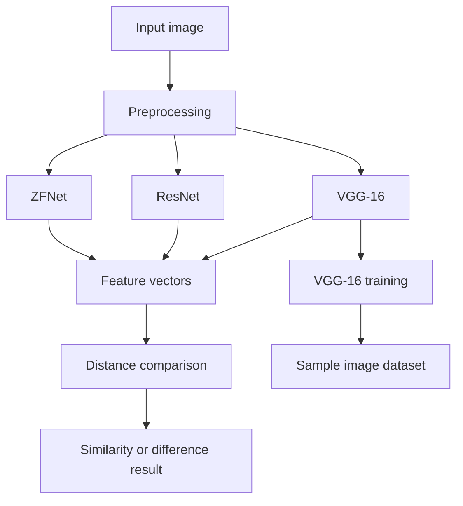

<p align="center">
	
</p>

<h1 align="center">Image features extraction using deep learning</h1>

<p align="center"><i>Deep learning-based image feature extraction and comparison using VGG-16, ResNet, and ZFNet.</i></p>


<p align="center">
	
	
	
</p>

<p align="center">
	
	
	
	
	
</p>


<p align="center">
	<a href="https://drive.google.com/drive/folders/1ZDxEePn27GfkPFJ8JVeDiOMn1-95TaAs?usp=sharing">Project drive link</a>
</p>

## Table of Contents

- [🚀 Project intro](#-project-intro)
- [📁 Project structure](#-project-structure)
- [⭐ Differentiators](#-differentiators)
- [🔧 Features](#-features)
	- [Flow diagram](#flow-diagram)
- [🧰 Tech stack](#-tech-stack)
- [⚙️ Install methods](#-install-methods)
	- [📦 Python / notebook setup](#-python--notebook-setup)
- [🔐 Environment variables](#-environment-variables)
- [🗄️ Model and data structure](#-model-and-data-structure)
- [📜 Available scripts](#-available-scripts)
- [🚀 Deployment notes](#-deployment-notes)
- [🤝 Contributing](#-contributing)
- [📄 License](#-license)

## 🚀 Project intro

`Image Features Extraction using Deep Learning` is a computer-vision project focused on extracting visual representations from images with multiple deep learning models.

The project currently centers on:

- Feature extraction with VGG-16, ResNet, and ZFNet
- Feature-vector distance comparison between extracted image representations
- Training VGG-16 on a sample image dataset

The repository appears to be distributed through the linked project drive, which contains the larger project assets.

## 📁 Project structure

```txt
Image-Features-Extraction-using-Deep-Learning/
├── LICENSE
├── README.md
└── .gitignore
```

The main implementation files are not present in this workspace snapshot. The project drive link above should be used to access the full code and data bundle.

## ⭐ Differentiators

- Uses more than one convolutional backbone for feature extraction
- Compares image feature vectors rather than relying on a single-model output
- Includes VGG-16 training on a sample image dataset
- Keeps the workflow focused on practical image feature analysis rather than a generic classifier-only setup

## 🔧 Features

### Core features

| Feature | Status | Notes |
| --- | --- | --- |
| Multi-model feature extraction | ✅ Current | Uses VGG-16, ResNet, and ZFNet to derive image features |
| Feature distance comparison | ✅ Current | Compares extracted feature vectors to measure similarity or difference |
| VGG-16 training | ✅ Current | VGG-16 is trained on a sample image dataset |
| Image-analysis workflow | ✅ Current | Centers on feature extraction and comparison for images |

### 🌊 Flow diagram

The flow below shows the intended analysis path from an input image to feature extraction and comparison.



## 🧰 Tech stack

- **Language:** Python
- **Domain:** Deep learning and computer vision
- **Models:** VGG-16, ResNet, ZFNet
- **Workflow:** Image preprocessing, feature extraction, and feature-distance comparison
- **Environment:** Python-based local analysis workflow, with notebook-friendly project packaging implied by the repository ignore rules

## ⚙️ Install methods

### 📦 Python / notebook setup

Prerequisites:

- Python 3.x
- A local environment with the deep learning and image-processing packages required by the project files
- Access to the project assets in the shared drive link

Typical setup flow:

1. Download or clone the project bundle.
2. Create and activate a Python virtual environment.
3. Install the dependencies required by the notebooks or scripts in the full project archive.
4. Open the notebook or run the training and feature-extraction code from the project files.

If the full project bundle includes a notebook, open it in Jupyter or VS Code and run the cells in order.

## 🔐 Environment variables

No environment variables are defined in the files available in this workspace snapshot.

If the full project bundle introduces model paths, dataset locations, or export directories, document them here in the same format.

## 🗄️ Model and data structure

This project is organized around image inputs and model outputs rather than a database schema.

Expected workflow artifacts include:

- Input images
- Model-generated feature vectors
- Distance or similarity results
- Trained VGG-16 weights or checkpoints, if saved by the implementation

## 📜 Available scripts

No standalone scripts are exposed in this workspace snapshot.

If the full project bundle contains notebooks or Python entry points, list them here with their purpose and usage.

## 🚀 Deployment notes

This project is best treated as a local or notebook-based deep learning workflow.

- Keep large model files and datasets outside the Git repository when possible.
- Use the shared drive link for the full project package if the code and data are too large for GitHub.
- If you publish the project publicly, make sure the training data and any generated artifacts are cleaned up or documented clearly.

## 🤝 Contributing

- Fork the repository and create a feature branch.
- Keep changes focused on one model, one preprocessing step, or one analysis path at a time.
- Avoid committing large datasets, generated checkpoints, or environment-specific files unless they are intentionally part of the project.

## 📄 License

This project is licensed under the MIT License.
See the [LICENSE](LICENSE) file for details.
